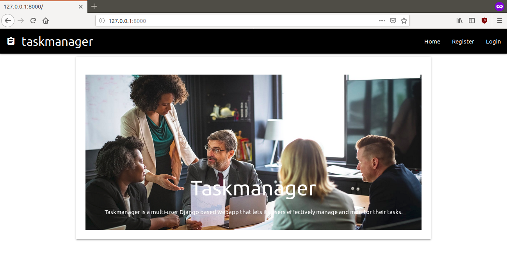

# fsf_2019_screening_task1 : Task Manager 


Taskmanager is a multi-user Django based webapp that lets its users effectively manage and monitor their tasks thereby increasing work productivity.
The webapp provides a simple easy to use user-friendly interface to collaborate with team members and track their task statuses.
## How it works
* Users can register and login onto the webapp.
* Authenticated users can create tasks and teams.
* Authenticated users can assign tasks to one or more members of their teams.
* Task Creators can edit their tasks.
* Team members can view and comment on task assigned to them or to their team members.

## Requirements
* Django 2.1.7
* Python 3.6.7
* Materialize CSS Framework
* JavaScript
* HTML5

## Installation

* Create a new directory for the project and navigate to that directory.

```bash
mkdir ProjectDirectory
cd ProjectDirectory
```
* Make a virtual environment and activate it.
```bash
python3 -m venv myvenv
source myvenv/bin/activate
```
* Upgrade to the latest version of pip.
```bash
python -m pip install --upgrade pip
```
* Install Django and other dependencies using requirements.txt .
```bash
pip install -r requirements.txt
```
## Usage
Navigate to the mysite directory of your project folder and run the following command to start a development server at http://127.0.0.1:8000/ .

```bash
python manage.py runserver
```

## Detailed Documentation
Browse [detailed documentation, installation and screenshots](https://drive.google.com/file/d/1AQOAUrvZkf8mjhhMixESvIhTWHVpZEBU/view?usp=sharing) on how to use the taskmanager app and collaborate with teams.
